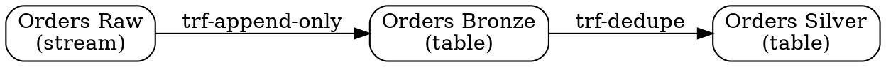
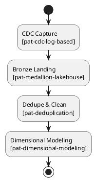
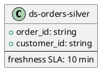
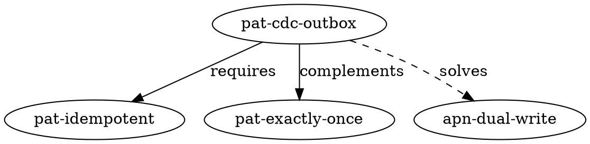
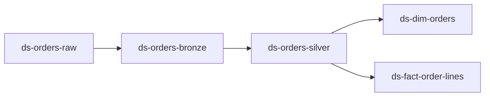
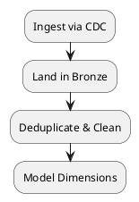
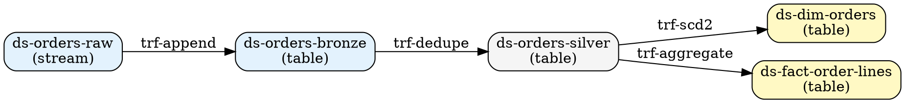

# Diagrams — Visualizing Models & Lineage

This document provides guidance on generating visual diagrams from model YAML files, including lineage graphs, pipeline flows, and entity-relationship diagrams.

---

## Overview

Visual diagrams help:
- **Engineers**: Understand data flow, dependencies, and architecture.
- **Stakeholders**: Communicate system design without reading YAML.
- **Auditors**: Trace lineage for compliance and impact analysis.
- **LLM Agents**: Validate generated models visually before presenting to users.

This project supports diagram generation via:
- **PlantUML**: Text-based UML for sequence diagrams, component diagrams, and state machines.
- **Graphviz (DOT)**: Directed graphs for lineage, data flow, and dependencies.
- **Mermaid**: Markdown-embeddable diagrams for docs (optional).

---

## Diagram Types

### 1. Lineage Graph (Graphviz)

**Purpose**: Show data flow from sources → transformations → sinks.

**Input**: Model instance YAML (`lineage` section).

**Output**: `.dot` file → rendered as PNG/SVG.

**Example Model Snippet**:
```yaml
lineage:
  - id: lin-orders-raw-to-bronze
    upstream: ds-orders-raw
    downstream: ds-orders-bronze
    transform: trf-append-only

  - id: lin-orders-bronze-to-silver
    upstream: ds-orders-bronze
    downstream: ds-orders-silver
    transform: trf-dedupe
```

**Generated Graphviz**:


**Render**:
```bash
dot -Tpng lineage.dot -o lineage.png
```

**Output**:
```
[ds-orders-raw] --> [ds-orders-bronze] --> [ds-orders-silver]
```

---

### 2. Pipeline Flow (PlantUML Activity Diagram)

**Purpose**: Visualize pipeline stages and their sequence.

**Input**: Model instance YAML (`pipelines.stages`).

**Output**: `.puml` file → rendered as PNG/SVG.

**Example Model Snippet**:
```yaml
pipelines:
  - id: pip-ingest-orders
    stages:
      - id: stg-cdc-capture
        uses_patterns: [pat-cdc-log-based]
      - id: stg-bronze-landing
        uses_patterns: [pat-medallion-lakehouse]
      - id: stg-dedupe-clean
        uses_patterns: [pat-deduplication]
      - id: stg-dim-model
        uses_patterns: [pat-dimensional-modeling]
```

**Generated PlantUML**:


**Render**:
```bash
plantuml pipeline-flow.puml
```

---

### 3. Entity-Relationship Diagram (PlantUML Class Diagram)

**Purpose**: Show datasets, contracts, and their relationships.

**Input**: Model instance YAML (`datasets`, `contracts`).

**Output**: ER-style diagram.

**Example Model Snippet**:
```yaml
datasets:
  - id: ds-orders-silver
    schema:
      fields:
        - name: order_id
          type: string
        - name: customer_id
          type: string

contracts:
  - id: ctr-orders-silver-v1
    dataset: ds-orders-silver
    sla:
      freshness_minutes: 10
```

**Generated PlantUML**:


---

### 4. Pattern Dependency Graph (Graphviz)

**Purpose**: Visualize pattern relationships (`related_patterns`, `required_traits`).

**Input**: Taxonomy pattern files.

**Output**: Graph showing `complements`, `conflicts`, `alternatives`, `solves`.

**Example**:


---

## Diagram Generation Script

**Location**: `/tools/scripts/gen_diagrams.py` (stub, to be implemented in Phase 5)

**Usage**:
```bash
# Generate lineage graph
python tools/scripts/gen_diagrams.py lineage model/examples/retail/model.example.yaml -o docs/diagrams/retail-lineage.dot

# Generate pipeline flow
python tools/scripts/gen_diagrams.py pipeline model/examples/retail/model.example.yaml -o docs/diagrams/retail-pipeline.puml

# Generate all diagrams for a model
python tools/scripts/gen_diagrams.py all model/examples/retail/model.example.yaml -o docs/diagrams/retail/
```

**Implementation Notes**:
- Parse YAML using `pyyaml`.
- Extract `lineage`, `pipelines`, `datasets` sections.
- Generate `.dot` or `.puml` via templates.
- Optionally auto-render using `dot` or `plantuml` CLI.

---

## Manual Diagram Creation

For quick prototyping or custom views:

### Lineage (Mermaid, for Markdown)



Embed in Markdown docs (GitHub, GitLab, Confluence).

### Pipeline (PlantUML)



---

## Rendering Tools

### PlantUML

**Install**:
```bash
# macOS
brew install plantuml

# Linux
sudo apt-get install plantuml

# Or use Docker
docker run -v $(pwd):/data plantuml/plantuml pipeline.puml
```

**Render**:
```bash
plantuml -tpng pipeline.puml
plantuml -tsvg pipeline.puml
```

### Graphviz

**Install**:
```bash
# macOS
brew install graphviz

# Linux
sudo apt-get install graphviz
```

**Render**:
```bash
dot -Tpng lineage.dot -o lineage.png
dot -Tsvg lineage.dot -o lineage.svg
```

### Mermaid

**Online Editor**: https://mermaid.live/

**CLI**:
```bash
npm install -g @mermaid-js/mermaid-cli
mmdc -i diagram.mmd -o diagram.png
```

---

## Embedding Diagrams in Docs

### Markdown

```markdown
# System Architecture


## Pipeline Flow


```

### Confluence / Notion

Upload rendered PNG/SVG images.

### Automated Docs (MkDocs, Sphinx)

Include diagrams in `/docs/` and reference in `.md` files.

---

## Diagram Conventions

### Color Coding

- **Bronze**: Light blue (#E3F2FD)
- **Silver**: Light gray (#F5F5F5)
- **Gold**: Light yellow (#FFF9C4)
- **PII Datasets**: Red border
- **Streaming**: Dashed edges
- **Batch**: Solid edges

### Node Shapes

- **Dataset**: Rectangle
- **Transform**: Ellipse
- **Check**: Diamond
- **Contract**: Hexagon

### Edge Labels

- **Lineage**: Transform UID (e.g., `trf-dedupe`)
- **Pattern Relationships**: `requires`, `complements`, `conflicts`, `solves`

---

## Example: Complete Lineage Diagram

**Model**:
```yaml
lineage:
  - id: lin-raw-to-bronze
    upstream: ds-orders-raw
    downstream: ds-orders-bronze
    transform: trf-append

  - id: lin-bronze-to-silver
    upstream: ds-orders-bronze
    downstream: ds-orders-silver
    transform: trf-dedupe

  - id: lin-silver-to-dim
    upstream: ds-orders-silver
    downstream: ds-dim-orders
    transform: trf-scd2

  - id: lin-silver-to-fact
    upstream: ds-orders-silver
    downstream: ds-fact-order-lines
    transform: trf-aggregate
```

**Generated Graphviz**:


**Rendered**:
```
[ds-orders-raw (bronze)] --> [ds-orders-bronze (bronze)] --> [ds-orders-silver (silver)] --> [ds-dim-orders (gold)]
                                                                                          \--> [ds-fact-order-lines (gold)]
```

---

## Best Practices

1. **Automate Where Possible**: Use scripts to generate diagrams from YAML; avoid manual duplication.
2. **Version Diagrams**: Store rendered diagrams in Git or link to generation commands.
3. **Keep Diagrams Simple**: Focus on high-level flow; omit implementation details.
4. **Use Consistent Styling**: Apply color coding and shapes uniformly across all diagrams.
5. **Embed in Docs**: Make diagrams easily accessible in README, architecture docs, and runbooks.

---

## Future Enhancements

- **Interactive Diagrams**: Web-based lineage explorer with zoom, filter, and search.
- **Real-Time Generation**: Auto-generate diagrams in CI and publish to docs site.
- **Diff Visualization**: Show changes between model versions (added/removed datasets, lineage).
- **Integration with Catalogs**: Sync diagrams to data catalogs (Alation, Atlan, DataHub).

---

**Next**: See `/docs/30-architecture.md` for overall system design, and `/tools/scripts/gen_diagrams.py` (stub) for implementation details.
